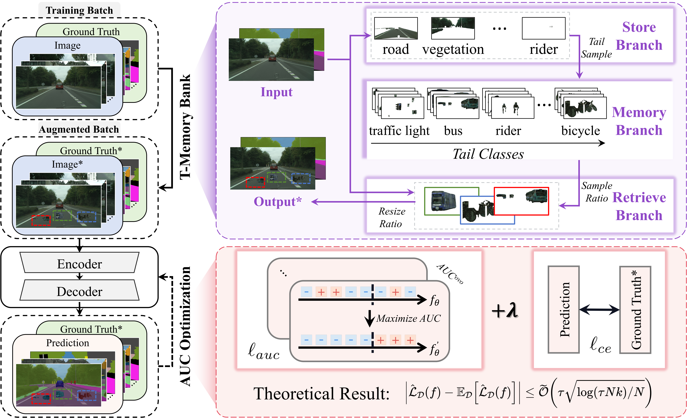

# AUCSeg
This repository is the official code for the paper " [AUCSeg: AUC-oriented Pixel-level Long-tail Semantic Segmentation](https://arxiv.org/abs/2409.20398)" (NeurIPS 2024).

**Paper Title: AUCSeg: AUC-oriented Pixel-level Long-tail Semantic Segmentation.**

**Author: [Boyu Han](https://boyuh.github.io/), [Qianqian Xu*](https://qianqianxu010.github.io/), [Zhiyong Yang](https://joshuaas.github.io/), [Shilong Bao](https://statusrank.github.io/), [Peisong Wen](https://scholar.google.com/citations?user=Zk2XLWYAAAAJ&hl=zh-CN&oi=ao), [Yangbangyan Jiang](https://jiangyangby.github.io/), [Qingming Huang*](https://qmhuang-ucas.github.io/)**



## Installation

* Clone the repository

```bash
git clone https://github.com/boyuh/AUCSeg.git
```

* Install the required libraries according to the guidelines in [MMSegmentation - get_started](https://github.com/open-mmlab/mmsegmentation/blob/v0.24.1/docs/en/get_started.md#installation).
* Download ADE20K, cityscapes, and coco_stuff164k according to the guidelines in [MMSegmentation - dataset_prepare](https://github.com/open-mmlab/mmsegmentation/blob/v0.24.1/docs/en/dataset_prepare.md).

- (Optional) If you want to use SegNeXt as the backbone, download the mscan-l pretrained model from [Our - Google Drive](https://drive.google.com/drive/folders/1ox_cNkmFO4cRfBOg7aoo7udSxoJlR7UZ) or [SegNeXt - TsingHua Cloud](https://cloud.tsinghua.edu.cn/d/c15b25a6745946618462/).

## Training

AUCSeg is a **plug-and-play component** that can be integrated into almost any existing backbone with just **two** simple modifications:

1. Add the `AUCLoss` module (options include `SquareAUCLoss`, `HingeAUCLoss`, and `ExpAUCLoss`) to the `loss_decode` in the model.
2. Add the `TMemoryBank` module to the `train_pipeline`.

Below, we use SegNeXt-large as an example backbone to demonstrate how to incorporate AUCSeg for training:

For the **ADE20K** dataset, run this command:

```bash
python tools/train.py aucseg_configs/aucseg.segnext.large.512x512.ade.160k.py --work-dir results/aucseg.segnext.large.512x512.ade.160k --seed 0 --gpu-id 0
```

For the **Cityscapes** dataset, run this command:

```bash
python tools/train.py aucseg_configs/aucseg.segnext.large.1024x1024.city.160k.py --work-dir results/aucseg.segnext.large.1024x1024.city.160k --seed 0 --gpu-id 0
```

For the **COCO-Stuff 164K** dataset, run this command:

```bash
python tools/train.py aucseg_configs/aucseg.segnext.large.512x512.coco_stuff164k.80k.py --work-dir results/aucseg.segnext.large.512x512.coco_stuff164k.80k --seed 0 --gpu-id 0
```

We provide the Config and Checkpoint for these three datasets.

|     Dataset     |   Backbone    |                            Config                            |                          Checkpoint                          |
| :-------------: | :-----------: | :----------------------------------------------------------: | :----------------------------------------------------------: |
|     ADE20K      | SegNeXt-large | [config](aucseg_configs/aucseg.segnext.large.512x512.ade.160k.py) | [Google Drive](https://drive.google.com/file/d/1NFJ49-5UVU2hRBq_YgJqyTbjT9fpCMod/view?usp=drive_link) |
|   Cityscapes    | SegNeXt-large | [config](aucseg_configs/aucseg.segnext.large.1024x1024.city.160k.py) | [Google Drive](https://drive.google.com/file/d/17uta7j6h8B9uVr_Te1P6AACNXPbCuEQN/view?usp=drive_link) |
| COCO-Stuff 164K | SegNeXt-large | [config](aucseg_configs/aucseg.segnext.large.512x512.coco_stuff164k.80k.py) | [Google Drive](https://drive.google.com/file/d/1W8fBSLdXaDbi8KnmQ-nZo_QBQ6v3mxRq/view?usp=drive_link) |

## Evaluation

To evaluate the model, run this command:

```bash
./tools/dist_test.sh /path/to/config /path/to/checkpoint_file 1 --eval mIoU
```

## Citation

If you find our work inspiring or use our codebase in your research, please cite our work.

```
@inproceedings{han2024aucseg,
    title={AUCSeg: AUC-oriented Pixel-level Long-tail Semantic Segmentation}, 
    author={Boyu Han and Qianqian Xu and Zhiyong Yang and Shilong Bao and Peisong Wen and Yangbangyan Jiang and Qingming Huang},
    booktitle={Advances in Neural Information Processing Systems},
    year={2024}
}
```

## Contact

If you find any issues or plan to contribute back bug-fixes, please contact us by Boyu Han (Email: hanboyu23z@ict.ac.cn).

## Acknowledgement

Our codes are based on [MMSegmentaion v0.24.1](https://github.com/open-mmlab/mmsegmentation/tree/v0.24.1), [SegNeXt](https://github.com/Visual-Attention-Network/SegNeXt) and [XCurve v1.1.0](https://github.com/statusrank/XCurve).
